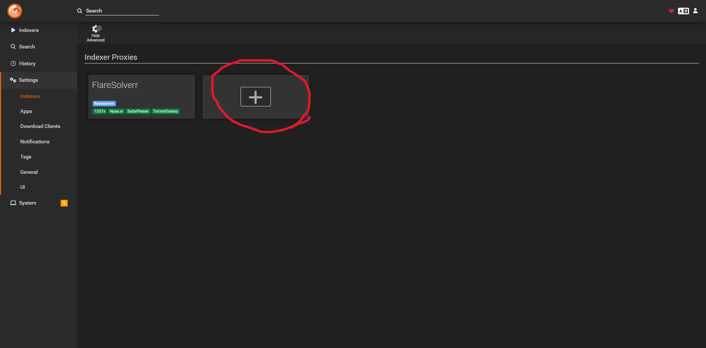

# How to set things up

## Prowlarr
### Setting up flaresolver
- Go to the settings and indexers and click on the + sign

- The localhost should already be set. If you change the port for docker make sure to change the port
- Make sure you add any tag name for this. I named it flaresolverr but you can name it whatever you like

### Setting up indexers
- To setup indexers go to indexer tab which is the top one on the side menu
- Click on + sign

- Click on the indexer you want to use. If you want to copy mine, check the images before this

- Some of the ones do need flaresolver such as 1337x so add the flaresolverr tag name that you entered

### Setting up for apps
> Note this part requires API key from individual apps to work
- Go to settings and apps on side menu
- Click on the + sign

- You will need api key for this to work. Go to settings and general inside the apps to get the api
- [Installation](arrAppSetup.md#How-to-get-api)

