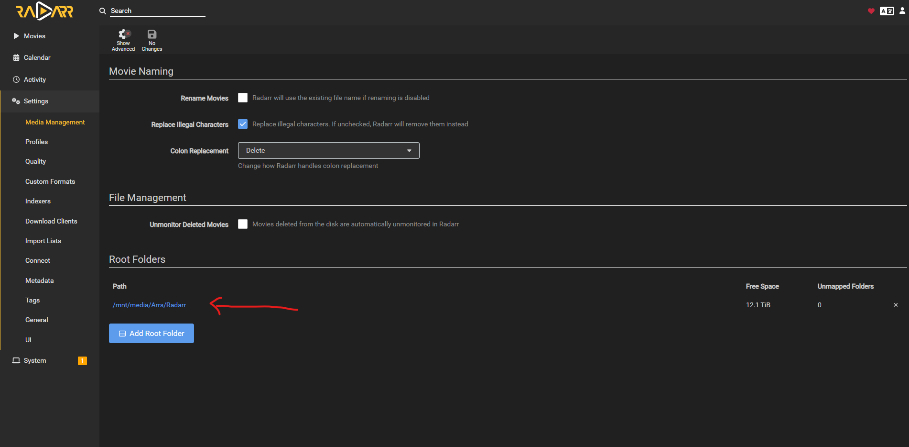
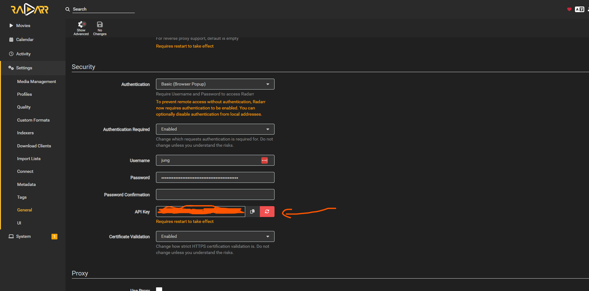
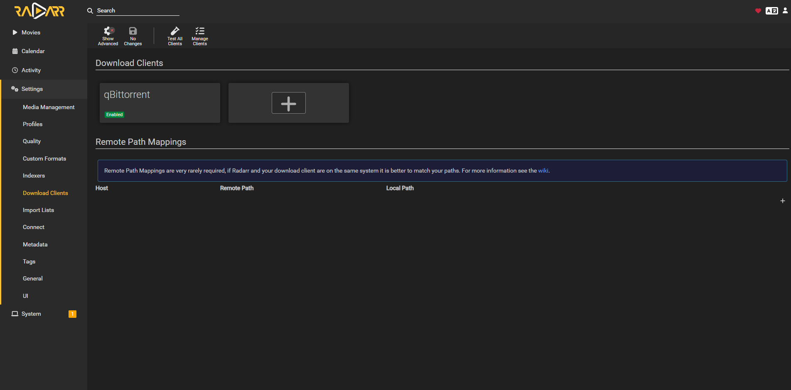
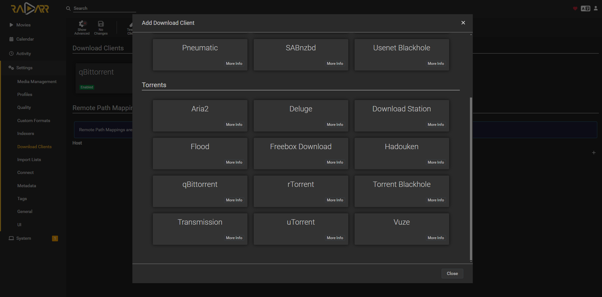

# All the arr apps setup
- Should be the same regardless what you want to do

## How to setup root folder for radarr
- This will be the folder that the Radarr will save to once the download finishes

## How to get api
- got to settings and general

## Setup download clients
- You can honestly use any one of the downloading clients that is listed there for the clients. I use qbittorrent but you can use any one of them.

